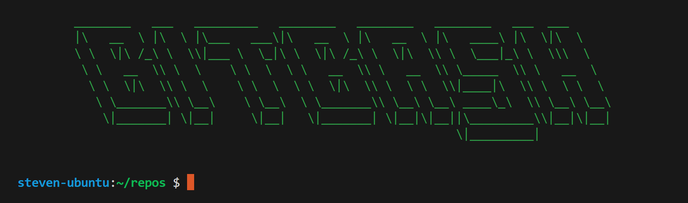

# BitBash

**BitBash** is a lightweight Unix-like shell written in Go. It supports key features found in modern shells like Bash, including redirection, piping, autocompletion, quoting, and command history.



---

## Features

### Redirection

- `<` — Redirect `stdin` from a file
- `>` / `>>` — Redirect `stdout` to a file (overwrite or append)
- `2>` / `2>>` — Redirect `stderr` to a file (overwrite or append)
- `&>` / `&>>` — Redirect both `stdout` and `stderr` to a file (overwrite or append)

### Piping

- `|` — Pipe `stdout` of one command into `stdin` of another

### Autocomplete

- `TAB` — Attempt to complete or partially complete a command name
- `TAB TAB` — If multiple matches exist, print all possible completions

###  Quoting

- `'...'` — Preserve literal value of characters inside single quotes
- `"..."` — Similar to single quotes, but supports escape sequences like `\\`, `\$`, and `\"`

###  Command History

- `↑` — Browse to the previous command
- `↓` — Browse to the next command

### Built-in Help

Type `help` at the prompt to list all built-in commands and available features.

---

## 🛠 Installation

You can install BitBash using:

```bash
go install github.com/steven-rivera/bitbash@latest
```

Once installed, run:

```
bitbash
```

You should now be inside the BitBash shell!