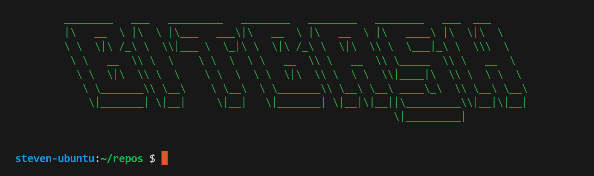

# BitBash

**BitBash** is a lightweight Unix-like shell written in Go. It supports key features found in modern shells like Bash, including redirection, piping, autocompletion, quoting, and command history.



## Features

### Redirection

- `<`:  Redirect `stdin` from a file
- `>`, `>>`: Redirect `stdout` to a file (overwrite or append)
- `2>`, `2>>`: Redirect `stderr` to a file (overwrite or append)
- `&>`, `&>>`: Redirect both `stdout` and `stderr` to a file (overwrite or append)

### Piping

- `|`: Pipe `stdout` of one command into `stdin` of another

### Autocomplete

- `TAB`: Attempt to complete or partially complete a command/file name
- `TAB TAB`: If multiple matches exist, print all possible completions

###  Quoting

- `'...'`: Preserve literal value of characters inside single quotes
- `"..."`: Similar to single quotes, but supports escape sequences like `\\`, `\$`, and `\"`

###  Command History

- `↑`: Browse to the previous command
- `↓`: Browse to the next command

## Builtin Commands

Bitbash comes with the following builtin commands:

- `help`: Prints more detailed information about builtin commands
- `exit [CODE]`: Exit the shell with code `CODE`. Default `0`
- `echo [ARG]...`: Print all arguments to `stdout`
- `type CMD`: Provide information about `CMD`
- `pwd`: Prints the current working directory
- `cd [DIR]`: change the current working directory to `DIR`
- `history`: prints previously executed commands

## History

Command history can optionally be saved and loaded from a file. Bitbash will load/save command history on startup/exit from the file specified in the `HISTFILE` environment variable. This allows history to persist between sessions of the Bitbash shell.

- `history.txt`: This repo provides a sample history file with example commands

## Running

### Installing

You can run BitBash by installing it as an executable using:

```bash
go install github.com/steven-rivera/bitbash/bitbash@latest
```

Once installed you can simply run:

```
HISTFILE="history.txt" bitbash
```

You should now be inside the BitBash shell!

### Without Installing

You can also run Bitbash without installing and executable by cloning the repo and running the `run.sh` script

```bash
git clone https://github.com/steven-rivera/bitbash && ./run.sh
```

## Requirements

- Go `>= 1.24`